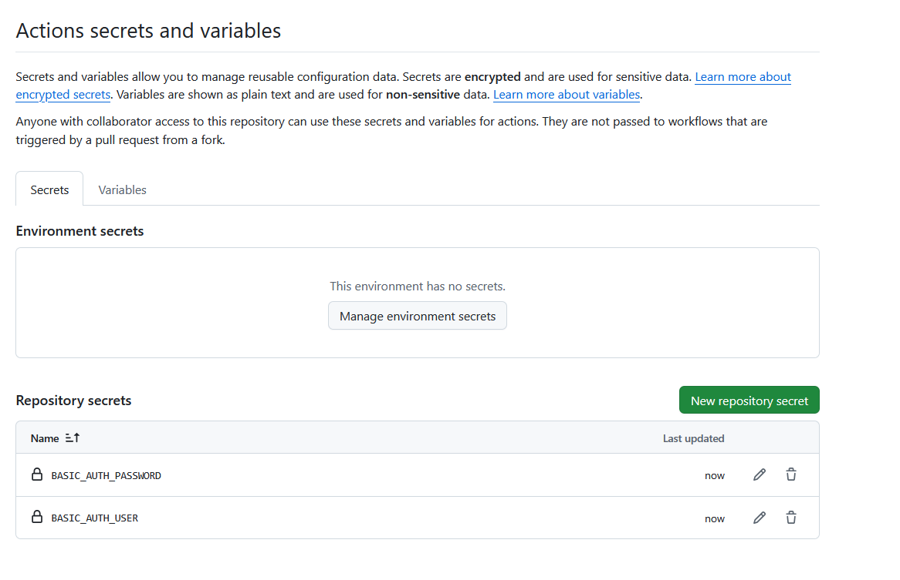

# WebDAV in DSM

This image builds a custom Nginx with WebDAV enabled and protects the service with HTTP Basic Authentication.

## Basic Auth Secrets

The GitHub Actions workflow generates `.htpasswd` during the image build. Configure these as repository-level Actions secrets:

- `BASIC_AUTH_USER`
- `BASIC_AUTH_PASSWORD`

Use **Repository secrets**, not environment secrets or variables. The workflow reads them through the `secrets` context and passes them to `scripts/generate-htpasswd.sh`.

CI creates one initial admin user. Set `BASIC_AUTH_USER` to `admin`, and set
`BASIC_AUTH_PASSWORD` to the admin password.



Setup path in GitHub:

1. Open the repository settings.
2. Go to `Secrets and variables` -> `Actions`.
3. Select the `Secrets` tab.
4. Add `BASIC_AUTH_USER` and `BASIC_AUTH_PASSWORD` under `Repository secrets`.

Do not commit `.htpasswd`; it is generated by the workflow and ignored by git.

Generate `.htpasswd` locally:

```bash
BASIC_AUTH_USER=admin BASIC_AUTH_PASSWORD=password1 sh scripts/generate-htpasswd.sh
```

## Link API

`cmd/link-api` provides a small Go HTTP API for creating links under a WebDAV
directory:

```bash
go run ./cmd/link-api
curl -X POST http://127.0.0.1:8080/symlink \
  -H 'Content-Type: application/json' \
  -d '{"src":"/var/www/source/movie.mkv","dist":"/var/www/data","name":"movie.mkv"}'
```

In the Docker image, nginx exposes the same API through `/link-api/`:

```bash
curl -X POST http://127.0.0.1:44433/link-api/symlink \
  -u "$BASIC_AUTH_USER:$BASIC_AUTH_PASSWORD" \
  -H 'Content-Type: application/json' \
  -d '{"src":"/var/www/source/movie.mkv","dist":"/var/www/data","name":"movie.mkv"}'
```

The API creates an absolute symlink at `dist/name` that points to `src`. For
nginx to serve it, `src` and `dist` must both be visible in the nginx container
or host namespace, and the nginx worker user must have permission to traverse
and read the target path.

The hardlink API uses the same request body at `/link-api/hardlink`. It creates
a hard link at `dist/name`, so `src` must be a file on the same filesystem as
`dist`.

The register API adds or updates a user in `/etc/nginx/.htpasswd`. It writes a
temporary file in `/etc/nginx`, preserves the existing auth file permissions,
and replaces the file atomically. Newly registered users use nginx's `{SHA}`
password format.

### Link API Reference

Endpoint:

```text
POST /link-api/symlink
POST /link-api/hardlink
POST /link-api/register
```

Request body:

```json
{
  "src": "/var/www/data/BVID",
  "dist": "/var/www/data/trash",
  "name": "BVID"
}
```

Fields:

- `src`: required. Source file or directory path inside the container. For
  hardlinks, this must be a file.
- `dist`: required. Destination directory path inside the container. It is
  created when it does not exist.
- `name`: optional. Symlink name under `dist`. When omitted, the API uses the
  base name of `src`.

The API returns `201 Created` when the symlink is created:

```json
{
  "link": "/var/www/data/trash/BVID",
  "src": "/var/www/data/BVID"
}
```

Create a symlink for a folder:

```bash
curl -X POST 'http://10.0.0.137:44433/link-api/symlink' \
  -u "$BASIC_AUTH_USER:$BASIC_AUTH_PASSWORD" \
  -H 'Content-Type: application/json' \
  -d '{
    "src": "/var/www/data/BVID",
    "dist": "/var/www/data/trash",
    "name": "BVID"
  }'
```

Create a symlink for a file:

```bash
curl -X POST 'http://10.0.0.137:44433/link-api/symlink' \
  -u "$BASIC_AUTH_USER:$BASIC_AUTH_PASSWORD" \
  -H 'Content-Type: application/json' \
  -d '{
    "src": "/var/www/data/BVID/3 分钟修复 Flex 布局的常见问题-1-BV1vRaCz7EJ1.mp4",
    "dist": "/var/www/data/trash"
  }'
```

Create a hardlink for a file:

```bash
curl -X POST 'http://10.0.0.137:44433/link-api/hardlink' \
  -u "$BASIC_AUTH_USER:$BASIC_AUTH_PASSWORD" \
  -H 'Content-Type: application/json' \
  -d '{
    "src": "/var/www/data/BVID/3 分钟修复 Flex 布局的常见问题-1-BV1vRaCz7EJ1.mp4",
    "dist": "/var/www/data/trash"
  }'
```

Register or update a WebDAV user:

```bash
curl -X POST 'http://10.0.0.137:44433/link-api/register' \
  -u "$BASIC_AUTH_USER:$BASIC_AUTH_PASSWORD" \
  -H 'Content-Type: application/json' \
  -d '{
    "username": "webdavuser1",
    "password": "password1"
  }'
```

URL paths are not filesystem paths. With the current nginx `alias
/var/www/data/`, a browser URL like `/BVID/example.mp4` maps to
`/var/www/data/BVID/example.mp4` inside the container.
